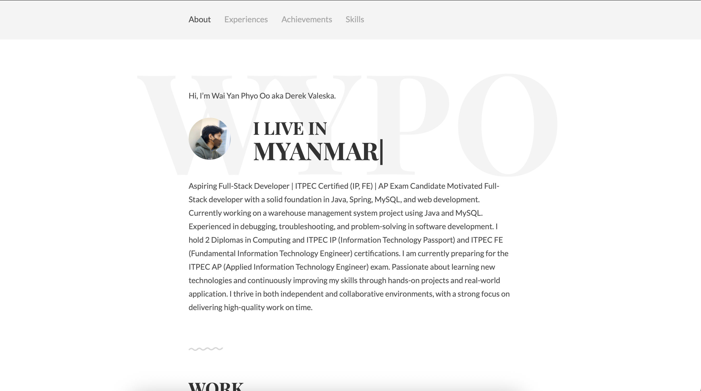

# 💼 Portfolio Website

A responsive and modern personal portfolio website built with HTML, CSS, JavaScript.

## 🌐 Live Demo

🔗 [View Website](https://waiyanphyooo21.github.io/portfolio/)

## 📸 Screenshots

## 🚀 Features

- Responsive design for all devices

## 🛠️ Tech Stack

- HTML5
- CSS3
- JavaScript
- Git & GitHub

## 💻 Getting Started

1. Clone the repo:
git clone https://github.com/waiyanphyooo21/portfolio.git
2. Open `index.html` in your browser or use Live Server in VS Code.

## 📬 Contact

- Email: dm@waiyanphyooo.online
- GitHub: [@waiyanphyooo21](https://github.com/waiyanphyooo21)

## ⭐️ Show Your Support

If you like this project, consider giving it a ⭐️ on [GitHub](https://github.com/waiyanphyooo21/portfolio)!

